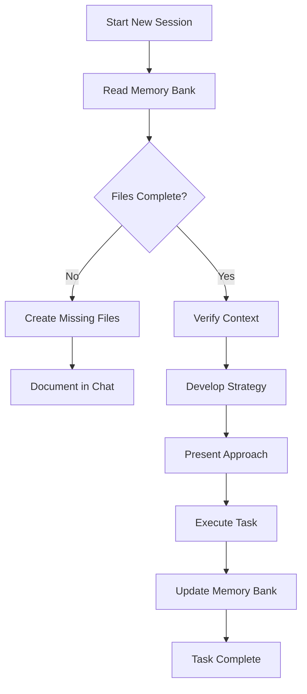
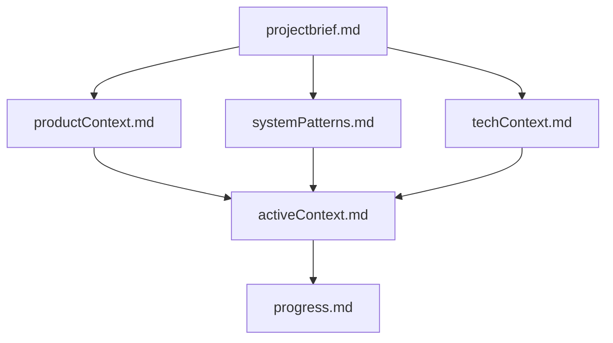

# Memory Bank: Cantik.AI Project Context

## Purpose
This Memory Bank system helps AI agents (like Kiro) quickly understand the project context in new sessions or when context window fills up. Instead of re-explaining everything, the AI can read these files to rebuild its understanding.

## How It Works

### Workflow


### File Structure


## Core Files

### 1. projectbrief.md
**Purpose:** Foundation document - project overview  
**Contains:**
- Project name, type, purpose
- Core value proposition
- Key features
- Business goals
- Success metrics
- Current status
- Stakeholders

**When to read:** Always read first in new session

---

### 2. productContext.md
**Purpose:** Business and user perspective  
**Contains:**
- User personas
- User journeys
- Feature priorities
- Design principles
- Competitive analysis
- Monetization strategy
- Success metrics
- Roadmap

**When to read:** When working on features, UX, or product decisions

---

### 3. systemPatterns.md
**Purpose:** Technical architecture and patterns  
**Contains:**
- System architecture
- Design patterns
- Database schema
- API design
- State management
- Security patterns
- Performance patterns
- Error handling
- Code conventions

**When to read:** When writing code or making technical decisions

---

### 4. techContext.md
**Purpose:** Development environment and stack  
**Contains:**
- Technology stack
- Project structure
- Environment configuration
- Development setup
- API integration
- Database schema
- Build & deployment
- Dependencies
- Known issues

**When to read:** When setting up, debugging, or deploying

---

### 5. activeContext.md
**Purpose:** Current state of development  
**Contains:**
- Recent work (last 24 hours)
- Completed tasks
- Current state
- Next steps
- Active files
- Environment status
- Blockers
- Code patterns to follow

**When to read:** Always read to understand what's happening now

---

### 6. progress.md
**Purpose:** Project status and tracking  
**Contains:**
- Development phases
- Sprint progress
- Feature completion status
- Sprint velocity
- Metrics & KPIs
- Blockers & risks
- Timeline
- Budget
- Next milestones

**When to read:** When planning work or reporting status

---

## Usage Guidelines

### For AI Agents

#### Starting a New Session
1. **Read Memory Bank files** in this order:
   - `projectbrief.md` (overview)
   - `activeContext.md` (current state)
   - `techContext.md` (if coding)
   - `systemPatterns.md` (if architecting)
   - `productContext.md` (if designing features)
   - `progress.md` (if planning)

2. **Verify context** is complete and up-to-date

3. **Ask clarifying questions** if anything is unclear

4. **Proceed with work** following established patterns

#### During Work
1. **Follow patterns** documented in systemPatterns.md
2. **Track changes** you make
3. **Monitor context window** usage

#### After Significant Changes
1. **Update activeContext.md** with:
   - What was changed
   - Why it was changed
   - Files modified
   - Impact of changes

2. **Update progress.md** if:
   - Feature completed
   - Sprint milestone reached
   - Blocker resolved

3. **Update systemPatterns.md** if:
   - New pattern introduced
   - Architecture changed
   - New convention established

### For Developers

#### Maintaining Memory Bank
- **Update activeContext.md** daily or after major changes
- **Update progress.md** weekly or at sprint boundaries
- **Update techContext.md** when dependencies change
- **Update systemPatterns.md** when architecture evolves
- **Update productContext.md** when features/roadmap change
- **Update projectbrief.md** rarely (only major pivots)

#### Best Practices
- Keep files concise but complete
- Use clear headings and structure
- Include code examples where helpful
- Link related documents
- Date significant updates
- Remove outdated information

---

## File Maintenance Schedule

### Daily Updates
- `activeContext.md` - Recent work, current state, next steps

### Weekly Updates
- `progress.md` - Sprint progress, metrics, timeline

### Monthly Updates
- `productContext.md` - Roadmap, priorities
- `techContext.md` - Dependencies, known issues

### As Needed
- `systemPatterns.md` - Architecture changes
- `projectbrief.md` - Major pivots only

---

## Benefits

### For AI Agents
- **Fast Context Rebuild** - Read files instead of long conversations
- **Consistent Understanding** - Same context every session
- **Better Decisions** - Full project knowledge available
- **Reduced Errors** - Follow established patterns

### For Developers
- **Onboarding** - New team members get up to speed quickly
- **Documentation** - Living documentation that stays current
- **Knowledge Transfer** - Project knowledge preserved
- **Context Switching** - Easy to resume after breaks

---

## Example Usage

### Scenario 1: New Feature Request
```
User: "Add email verification to registration"

AI Agent:
1. Reads projectbrief.md → Understands project
2. Reads productContext.md → Sees it's in Phase 2 roadmap
3. Reads techContext.md → Knows tech stack (FastAPI, React)
4. Reads systemPatterns.md → Follows auth patterns
5. Reads activeContext.md → Checks current priorities
6. Proposes implementation plan
7. Updates activeContext.md after completion
```

### Scenario 2: Bug Fix
```
User: "Profile page not loading"

AI Agent:
1. Reads activeContext.md → Sees recent profile work
2. Reads techContext.md → Checks API endpoints
3. Reads systemPatterns.md → Reviews error handling patterns
4. Debugs issue
5. Updates activeContext.md with fix
```

### Scenario 3: Deployment
```
User: "Deploy to VPS"

AI Agent:
1. Reads progress.md → Sees deployment is Phase 5
2. Reads techContext.md → Gets deployment instructions
3. Reads systemPatterns.md → Reviews production patterns
4. Executes deployment
5. Updates progress.md (Phase 5: 0% → 100%)
6. Updates activeContext.md with deployment details
```

---

## Quick Reference

### File Sizes (Approximate)
- projectbrief.md: ~1KB (short)
- productContext.md: ~5KB (medium)
- systemPatterns.md: ~10KB (long)
- techContext.md: ~8KB (long)
- activeContext.md: ~6KB (medium, changes frequently)
- progress.md: ~7KB (long)

### Read Time
- Full Memory Bank: ~5 minutes
- Essential files (brief + active): ~1 minute
- Quick context (activeContext only): ~30 seconds

### Update Time
- activeContext.md: ~2 minutes
- progress.md: ~5 minutes
- Other files: ~10 minutes each

---

## Related Resources
- Project documentation: `01-project-overview/`
- Code: `src/` (frontend), `backend-python/` (backend)
- Database: `backend-python/cantik_ai.db`

---

**Created:** 2026-03-03  
**Last Updated:** 2026-03-03 11:45 WIB  
**Status:** ✅ Active and maintained
